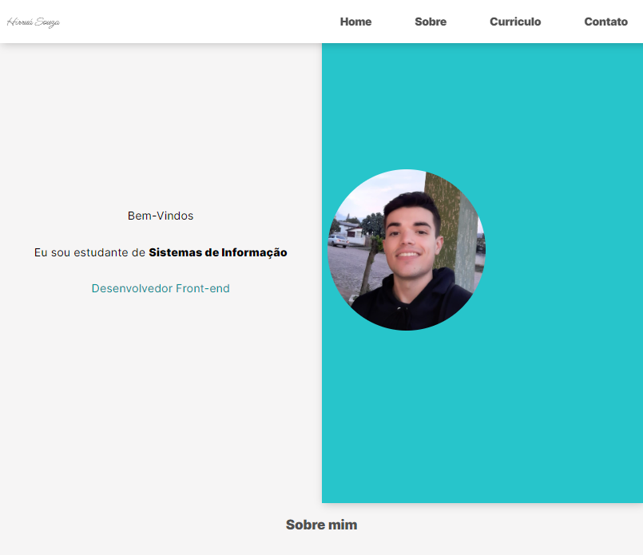

# Meu  Currículo

> Dev labs AMF

Projeto construido no evento da Faculdade Antonio Meneghetti.

[🔗 Clique aqui para acessar](https://Hirrua.github.io/curriculo)

## 🎓 Aprendizagem

Com esse mini curso de tive a opurtunidade de aprender algumas funções no javascript, onde posso aprender muito mais e consequentemente melhorar meus futuros projetos.

## 🧩 Dificuldades

Ainda tenho dificuldades com a criação de sites responsivel. Onde futuramente irei aprimorar.

## ⚙ Tecnologias

- HTML
- CSS
- Javascript
- Git e Github

## ✉ Contato

hirrua.silva20@gmail.com